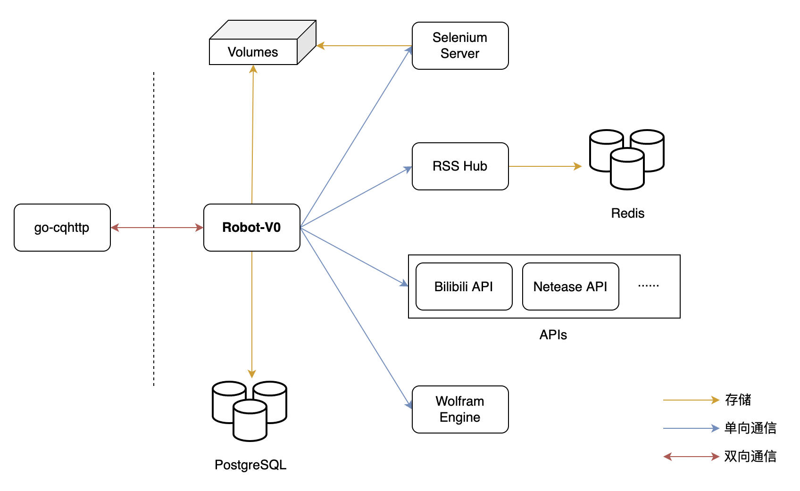

<p align="center">
  <a href="https://icon-icons.com/zh/%E5%9B%BE%E6%A0%87/%E6%9C%BA%E5%99%A8%E4%BA%BA-%E8%87%AA%E5%8A%A8%E5%8C%96-%E8%A1%A8%E6%83%85-%E8%A1%A8%E6%83%85%E7%AC%A6%E5%8F%B7/209655">
    
  </a>
</p>
<h1 align="center">Robot-V0</h1>
<p align="center">🤖️ 我的Q群机器人，由OneBot协议和go-cqhttp强力驱动。</p>

<p align="center">
    <a href="https://github.com/Sh-Zh-7/Robot-V0/issues" style="text-decoration:none" >
        
    </a>
    <a href="https://github.com/SSh-Zh-7/Robot-V0" style="text-decoration:none" >
        
    </a>
    <a href="https://github.com/Sh-Zh-7/Robot-V0" style="text-decoration:none" >
        
    </a>
  	<a href="https://github.com/Sh-Zh-7/Robot-V0" style="text-decoration:none">
        
    </a>
</p>
# 架构




# 特性

- 检测Github链接并用OpenGraph可视化展示。
- 嗅探Bilibilil视频链接并利用逆向API获取其元信息。
- 轮询Bilibili用户动态并返回其浏览器截图作为通知。
- 基于RSSHub实现高度可扩展的主流社交媒体的订阅。
- KFC疯狂星期四文案定时发布和提醒功能。
- 通过支持Wolfram语言来兼容MMA的大部分数学运算功能。
- 高自由度历史记录查询来替代QQ仅依赖内容的原生查询功能。
- 移植Twitter热门的makeitaquote和progress_of_year等功能。

还有很多如网易云音乐查询转发、自动跟随复读和多重随机骰子等功能。

这些功能对应的指令和更多的功能请见项目的[文档](./docs/index.md)。


# 部署

首先使用go-cqhttp在本机上模拟登陆，生成虚拟设备信息文件`device.json`并放到`config`目录下。

然后修改`config/cqhttp.yml`上的[认证信息](https://github.com/Sh-Zh-7/Robot-V0/blob/main/config/cqhttp.yml#L4)，把修改后的项目全部传输至服务器上。

接下来在服务器上创建数据库需要挂载的目录，具体的目录名请见[docker-compose](https://github.com/Sh-Zh-7/Robot-V0/blob/main/docker/docker-compose.prod.yml)配置文件。

由于本项目使用了Docker虚拟化技术，在完成上述工作之后，你可以通过下列指令在x86机器上实现一键部署：

```shell
docker-compose --project-directory . --file ./docker/docker-compose.prod.yml up
```

如果你和我一样使用Mac M1来进行本地开发，你可以执行下面的指令：

```shell
docker-compose --project-directory . --file ./docker/docker-compose.dev.yml up
```


# TODO

- [ ] 实现基于RBAC/LDAP的指令动态授权。
- [ ] 利用RSSHub进一步扩展直播订阅功能（虎牙、斗鱼等）。
- [ ] 使用IMDB/TMDB API支持影视信息的查阅。
- [ ] 编写并使用一个类Spring的IOC和AOP功能子集的OneBot SDK。
- [ ] 仿照TextQL和GitQL实现用SQL查询历史聊天记录。
- [ ] 进行微服务的拆分，做一切云原生应用该做的事情。


# 鸣谢

> [IntelliJ IDEA](https://zh.wikipedia.org/zh-hans/IntelliJ_IDEA) 是一个在各个方面都最大程度地提高开发人员的生产力的 IDE，适用于 JVM 平台语言。

特别感谢 [JetBrains](https://www.jetbrains.com/) 为开源项目提供免费的 [IntelliJ IDEA](https://www.jetbrains.com/idea/) 等 IDE 的授权 

 [](https://www.jetbrains.com/)

