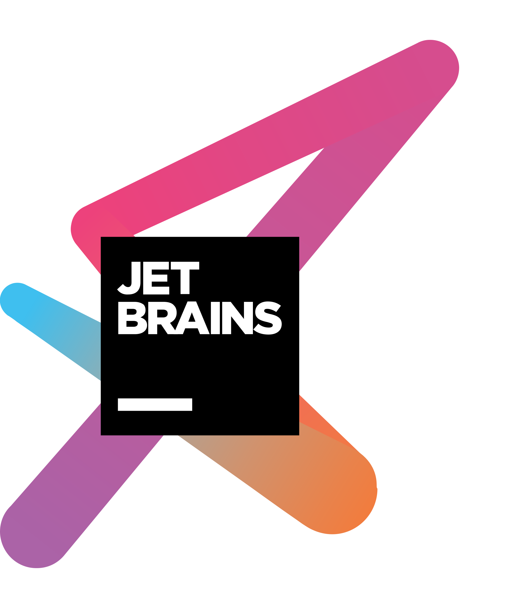

<h1 align="center">Robot-V0</h1>

🤖️ 我的Q群机器人，由OneBot协议和go-cqhttp强力驱动。

    
    
  

# 特性

- 检测Github链接并用OpenGraph可视化展示。
- 嗅探Bilibilil视频链接并利用逆向API获取其元信息。
- 轮询Bilibili用户动态并返回其截图作为通知。
- 基于RSSHub实现高度可扩展的主流社交媒体的订阅。
- KFC疯狂星期四文案定时发布和提醒功能。
- 通过支持Wolfram语言来兼容MMA的大部分数学运算功能。
- 高自由度历史记录查询来替代QQ仅依赖内容的原生查询功能。
- 移植Twitter热门的makeitaquote和progress_of_year等功能。

还有很多如网易云音乐查询转发、自动跟随复读和多重随机骰子等功能。

# TODO

- [ ] 实现基于RBAC/LDAP的指令动态授权。
- [ ] 利用RSSHub进一步扩展直播订阅功能（虎牙、斗鱼等）。
- [ ] 使用IMDB/TMDB API支持影视信息的查阅。
- [ ] 编写并使用一个类Spring的IOC和AOP功能自己的OneBot SDK。
- [ ] 进行微服务的拆分，做一切云原生应用该做的事情。

## 鸣谢

> [IntelliJ IDEA](https://zh.wikipedia.org/zh-hans/IntelliJ_IDEA) 是一个在各个方面都最大程度地提高开发人员的生产力的 IDE，适用于 JVM 平台语言。

特别感谢 [JetBrains](https://www.jetbrains.com/) 为开源项目提供免费的 [IntelliJ IDEA](https://www.jetbrains.com/idea/) 等 IDE 的授权 

 

