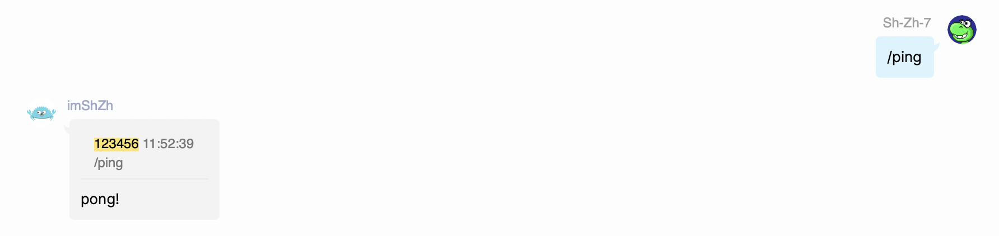
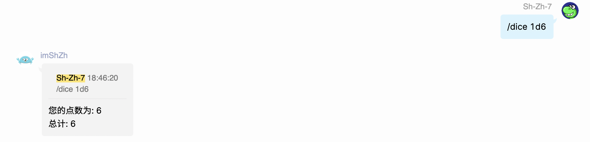
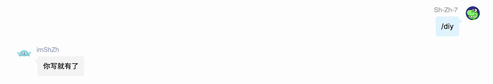
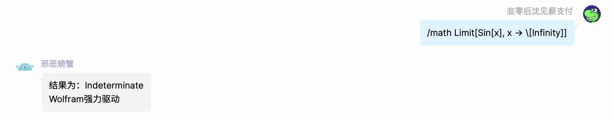
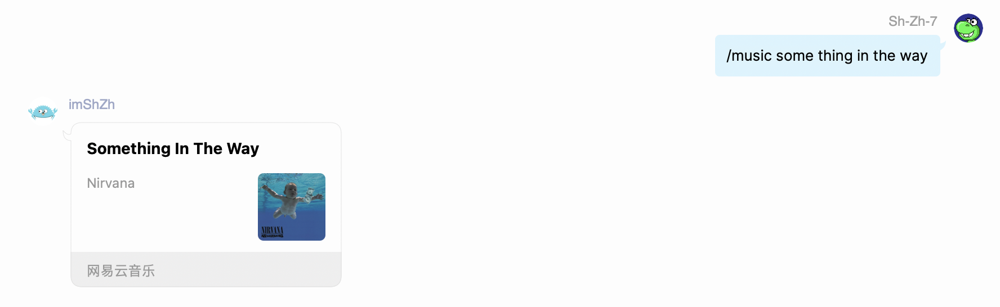

# `/ping`：检查机器人是否在线

如果机器人在线（不是因为内部抛出异常等原因终止），他就会回复一个`pong!`。

这种ping-pong风格的请求与响应来自于Redis。




# `/dice`：多重随机骰子

指令格式：`/dice <num1>d<num2>`，其中，num1是骰子的数目，num2是骰子的最大点数（没错，我们允许最大点数大于6的非常规骰子出现）。

比如`/dice 1d6`就是投出1个最大点数为6的骰子；`/dice 5d10`就是投出5个最大点数为10的骰子。

最后机器人会返回每一个骰子的结果和它们的综合，如下图所示：



注意为了防止刷屏，骰子的**数目不能超过10**，最大**点数不能超过100**。


# `/diy`：你写就有了

这个功能源自[Eric](https://github.com/ExerciseBook)的群聊「咕上银河、不死就鸽」。

每当有群友提出一个feature request的时候，让机器人回复一个“你写就有了”很应景。




# `/find`：高级历史记录查询

QQ内置的历史记录查询功能只支持内容的查询，我想知道一个具体用户说了那些话都做不到。但是这个机器人能帮你做到。

目前`/find`仅支持内容的查询和用户的查询。`\find`指令的格式如下：

```
/find [u:user] [text]
```

其中，`[]`表示可以省略的内容，下面给出`\find`指令的一些例子：

- `/find 你好`：查找聊天记录中包含“你好”的记录；
- `/find u:Sh-Zh-7`：查找用户`Sh-Zh-7`所有的发言记录；
- `/find u:imShZh 大家好`：查找用户`imShZh`所有发言中包含“大家好”的记录。


注意为了防止刷屏，机器人**最多只返回5条**消息记录。


# `撤回`：撤回你自己的消息

QQ内置的消息撤回有一个时间限制，超过这个时间限制就无法撤回自己的消息了。只有请管理员/群主出马才行。

如果你把这个机器人设置为管理员，那么你就可以通过回复相关的消息并输入`撤回`，然后让机器人帮你撤回。

注意机器人必须得是管理员/群主，而且你只能撤回你自己的消息。


# `/math`：执行数学计算

本机器人内置了Wolfram Engine，这意味着你可以通过Wolfram表达式让它执行相当复杂的数学计算。

比如说下图所示的计算积分的功能：




# `/music`：搜索音乐并转发

通过指定音乐的名字，机器人就能自动转发相关的音乐。

这个功能主要依赖CQ内置的音乐转发功能。



注意在具体的实现中，机器人总是会返回第一条搜索的结果，而这个结果并不一定准确。


# `/progress`：一年的进度

显示当前日期在本年的进度。这个功能源自推特的[year progress](https://twitter.com/year_progress)。

推特的这个是每隔3/4天自动发布，这也太频繁了，很难让人感受到时间的飞逝。

本项目直接通过`/progress`指令显式地查看一年的进度。


# `/quote`：让消息变成名言

这个功能源于推特的[makeitaquote](https://mobile.twitter.com/makeitaquote)。通过回复任意群友的言论并回复`/quote`，就获得类似如下的反馈：

