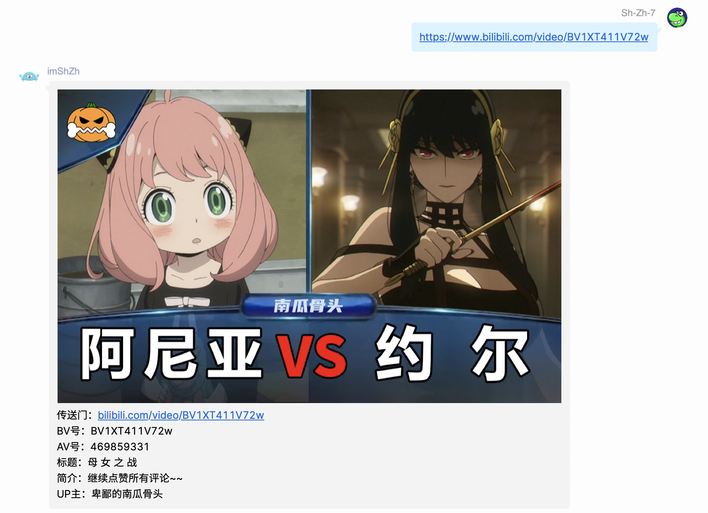
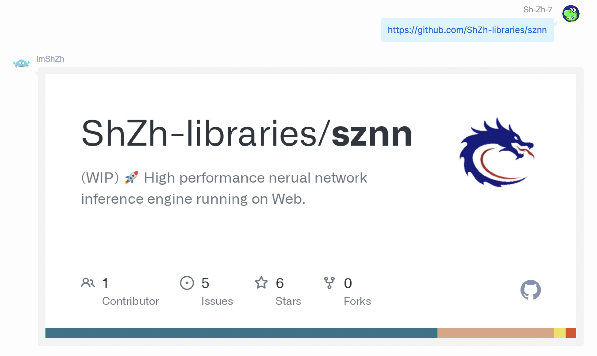

# 自动跟随复读

当群友复读到了一定程度的时候，机器人也加入复读大军。

# KFC疯狂星期四提醒

每到星期四正午12点，机器人就会往群里发一则疯狂星期四的文案。

# Bilibili视频链接监测

当群友发送一条B站视频链接的时候，机器人会自动查询这条视频的信息并返回。

这样你就可以知道这条链接指向的视频是什么内容的了。

# Github链接监测

当群友发送一条Github链接的时候（仓库、issue还是PR），机器人会返回这个链接的OpenGraph图片。

这张图片上蕴含着这条链接指向内容的各种相关信息，这样群友不用点开链接就知道是关于什么的了。

