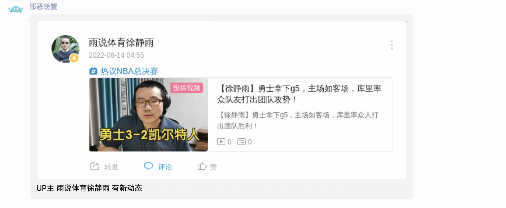
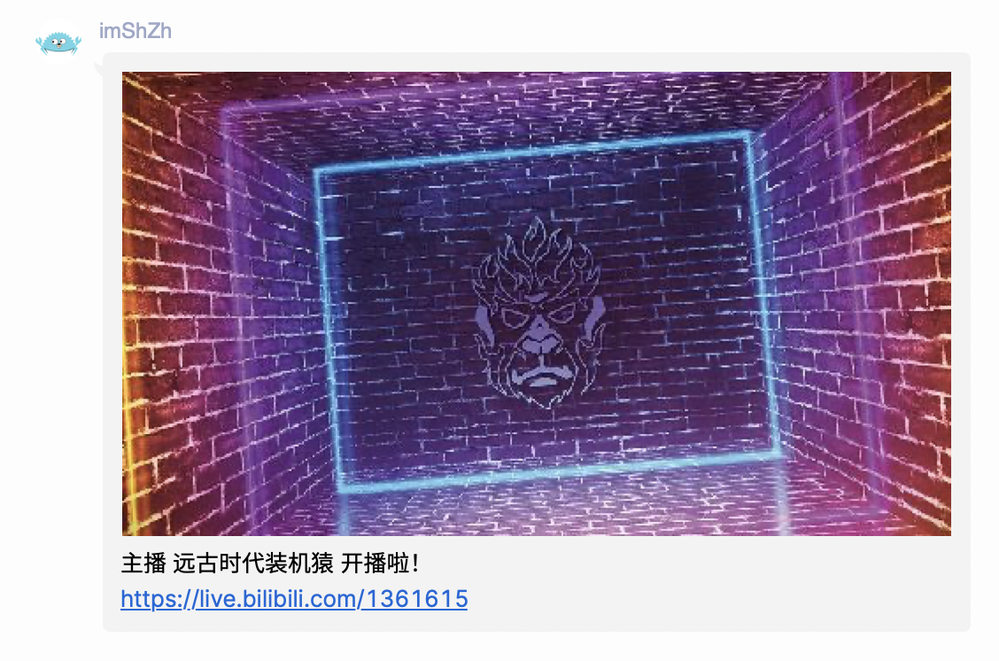
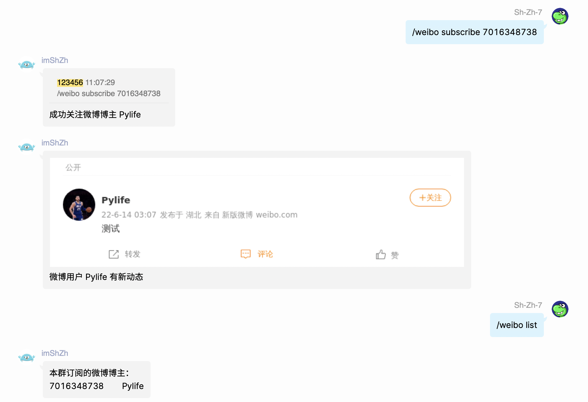
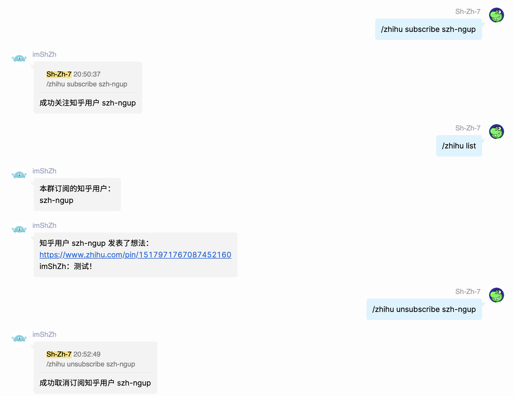
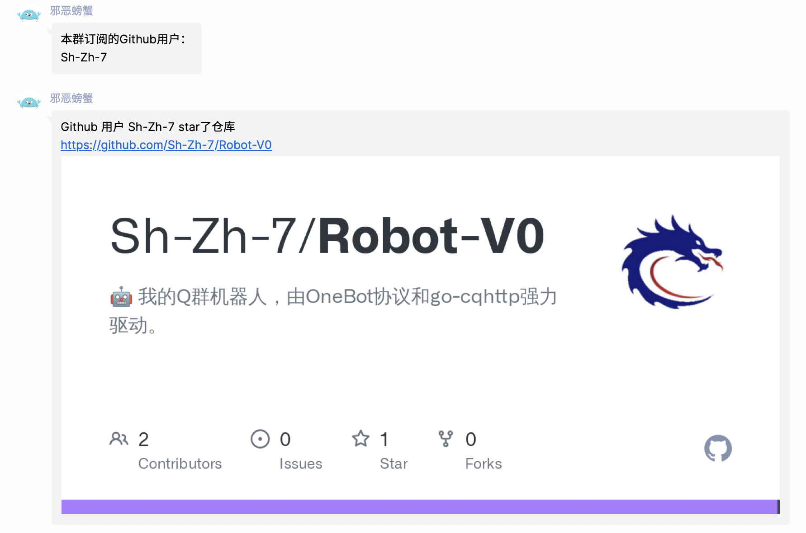

所有社交媒体的订阅都具有以下的子指令，我们假设指令为`/xxx`，那么所有的子指令为：

- `/xxx subscribe <user>`：订阅某个用户；
- `/xxx list`：展示所有已经订阅的用户；
- `/xxx unsubscribe <user>`：取消订阅某个用户。

其中，user表示该用户在社交媒体上的名字或者ID。

【P.S.】一般都是ID，因为名字容易输错（记错）而且可能会产生歧义（同一个名字多个用户）。

# Bilibili用户动态

每当用户发布新动态（包括发布新视频和文字动态），就返回动态的浏览器截图。

# Bilibili直播

当主播开播的时候，就返回主播的直播封面和地址。

# 微博动态

当微博用户发布新动态的时候，就返回动态的浏览器截图。

# 知乎回答、文章和想法

当订阅的知乎用户发布新回答/文章/想法的时候，就返回相应的内容。

# Github动态

当订阅的Github用户创建仓库/fork仓库/star仓库的时候返回仓库的OpenGraph图片。

注意follow用户这一动态无法通过Atom订阅。